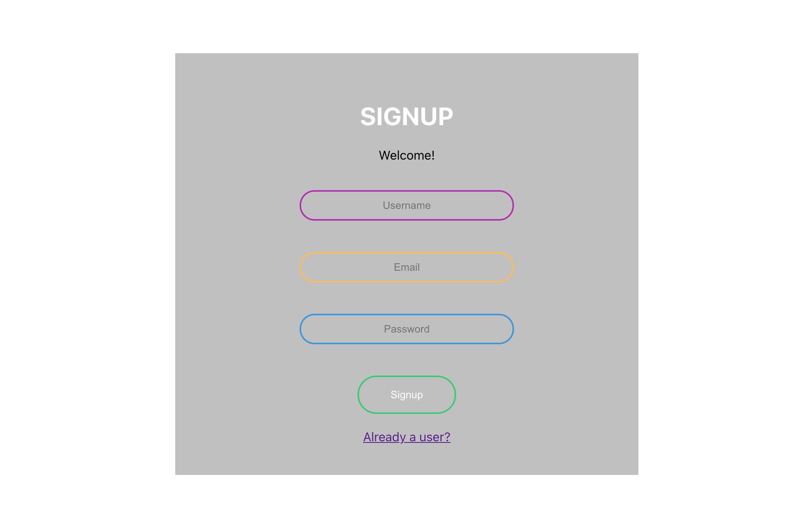

<h1 align="center">MERN JWT LOGIN PAGE BOILER PLATE</h1>


  
<br />
## Description
🔍 
MERN JWT Login Authentication. 
Login and sign up page template ti start a project from. Does Require Mongodb Atlas, and does require filling some information before it is able to run, so make sure you go through the folders and fill in the missing information. Be creative and make it yours. 
## Table of Contents
- [Description](#description)
- [License](#license)
- [Installation](#Installation)

```
npm install 
```

## Usage

Run the command in the root of the directory to launch db server and react app

```
npm start
```


## License

<br />
This application is covered by the MIT license. 
## Contributing
Eddie Ibarra
<br />